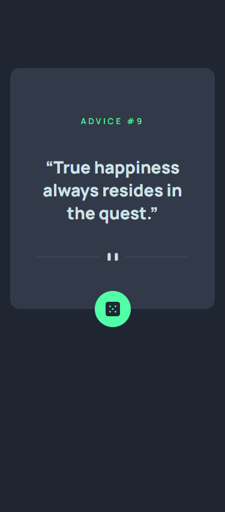
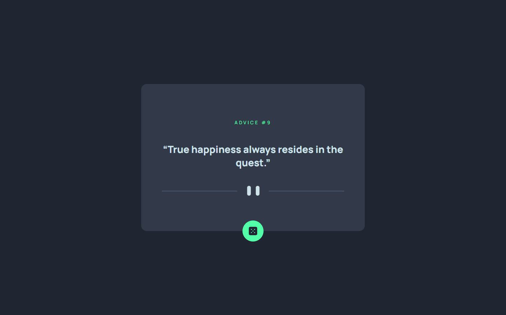

# Frontend Mentor - Advice generator app solution

This is a solution to the [Advice generator app challenge on Frontend Mentor](https://www.frontendmentor.io/challenges/advice-generator-app-QdUG-13db). Frontend Mentor challenges help you improve your coding skills by building realistic projects.

## Table of contents

- [Overview](#overview)
  - [The challenge](#the-challenge)
  - [Screenshot](#screenshot)
  - [Links](#links)
- [My process](#my-process)
  - [Built with](#built-with)
  - [What I learned](#what-i-learned)
  - [Continued development](#continued-development)
  - [Useful resources](#useful-resources)
- [Author](#author)

**Note: Delete this note and update the table of contents based on what sections you keep.**

## Overview

### The challenge

Users should be able to:

- View the optimal layout for the app depending on their device's screen size
- See hover states for all interactive elements on the page
- Generate a new piece of advice by clicking the dice icon

### Screenshot




### Links

- Solution URL: [Github](https://github.com/marijahavaic/fm-advice-generator-app)
- Live Site URL: [Github Pages](https://marijahavaic.github.io/fm-advice-generator-app/)

## My process

### Built with

- Semantic HTML5 markup
- Flexbox
- Mobile-first workflow
- [React](https://reactjs.org/) - JS library
- [React Query](https://react-query-v3.tanstack.com/) - React library for fetching API
- [React Device Detection](https://www.npmjs.com/package/react-device-detect) - React library for device detection
- [SASS](https://sass-lang.com/) - For styles

### What I learned
I learned how to make a fetch request with React Query

```js
 async function getAdvice() {
    const { data } = await axios.get("https://api.adviceslip.com/advice");
    return data
  }
  // react-query hook for fetching the data
  const { data, error, isError, isLoading, refetch } = useQuery("getQuote",() => getAdvice());
```
And how to refetch onClick
```js
   <button className="dice" onClick={refetch}>
      
    </button>
```

### Continued development
I would like to use React Query more as I can see a lot of benefits of this library.

### Useful resources

- [React Query Tutorial](https://www.youtube.com/watch?v=VtWkSCZX0Ec&list=PLC3y8-rFHvwjTELCrPrcZlo6blLBUspd2&index=2) - This tutorial helped me understand React Query
- [React Query useQuery](https://tanstack.com/query/v4/docs/react/reference/useQuery?from=reactQueryV3&original=https%3A%2F%2Freact-query-v3.tanstack.com%2Freference%2FuseQuery) - This helped me understand how can I use useQuery hook.
- [Shake Animation](https://www.w3schools.com/howto/howto_css_shake_image.asp) 

## Author

- Website - [Marija Havaic](https://marijahavaic.com)
- Frontend Mentor - [@marijahavaic](https://www.frontendmentor.io/profile/marijahavaic)

